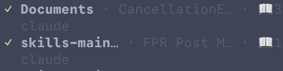
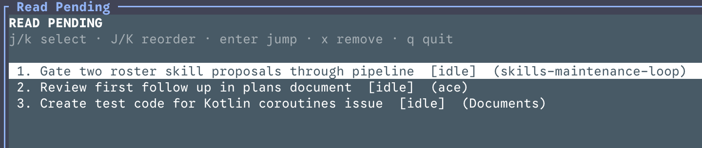

# readpending

Mark [herdr](https://herdr.dev) agents you started reading but haven't finished.
For the case: an agent finishes, you jump to it, skim, get pulled away before
reading it all — flag it as **read pending** so you come back.



## What it does

- **Toggle** read-pending on the focused agent (manual, both directions).
- Marked agents get a numbered badge (`📖1`, `📖2`, …) exposed as the pane
  token `$read`, in the order you marked them. This shows in the sidebar and is
  your always-visible, global view of what's pending and in what order.
- A **summon-anywhere overlay list** to reorder the reading queue and jump to
  an agent.
- **Auto-clear on focus**: when you focus a pending agent you're reading it now,
  so its mark is removed and the rest renumber. Marking an agent while you're
  already focused on it does *not* self-clear (only an unfocused→focused
  transition clears).

### Why there's a daemon

herdr has **no plugin trigger that fires on focus** (the manifest `[[events]]`
table parses but its hook allowlist accepts none of the pane/agent event names —
they warn `unknown event`). So auto-clear-on-focus can't be declarative; it needs
a running process. A herdr pane can't float across workspaces either, so the list
is an overlay you summon and dismiss — which can't host a persistent watcher.

The watcher is therefore a small **companion daemon** (`readpending.py daemon`):

- started automatically when you mark an agent (and when you open the list);
- polls agent state once a second and clears a pending pane the moment it gains
  focus;
- **self-exits** as soon as the queue is empty (so it only exists while you have
  something pending), or if the herdr server goes away;
- single-instance via a pidfile; talks only to the local herdr socket, no
  network.

## Install

```sh
herdr plugin install rcosteira79/herdr-plugins/readpending
```

Or link a local checkout: `herdr plugin link /path/to/herdr-plugins/readpending`.
Re-run `install`/`link` after a `herdr update` — updates drop plugins.

### Config (`~/.config/herdr/config.toml`)

Two edits. `herdr server reload-config` after any change.

**1. Show the badge** — the mark is a `$read` pane token; tokens only render if a
sidebar row references them:

```toml
[ui.sidebar.agents]
rows = [["state_icon", "workspace", "tab", "$read"], ["agent"]]
```

**2. Keybindings**:

```toml
[[keys.command]]
key = "prefix+p"
type = "shell"
command = "herdr plugin action invoke toggle --plugin rcosteira.readpending"
description = "toggle read-pending"

[[keys.command]]
key = "prefix+shift+p"
type = "shell"
command = "herdr plugin pane open --plugin rcosteira.readpending --entrypoint list --placement overlay"
description = "read-pending list"
```

Keep the `description` lines. A `#` comment documents the binding for you, but
herdr never reads it — the help panel on `prefix+?` lists a binding with no
`description` as `custom command`, which tells you nothing about what the key
does.

The toggle is also a `pane`-context action, but herdr does **not** surface plugin
actions in its right-click pane menu — the keybinding is the trigger.

## Overlay list keys



```
j / k or ↓ / ↑   move selection
J / K            move the selected agent later / earlier in the queue
enter            jump to the selected agent and close the overlay
x                remove the selected agent from the queue
q / esc          close
```

Re-polls every second while open.

## How it works

- Queue: `HERDR_PLUGIN_STATE_DIR/queue.json` (falls back to
  `~/.local/state/herdr/readpending/`), an ordered list of pane ids mutated
  under an `flock`.
- Badge: `herdr pane report-metadata <pane> --source rcosteira.readpending
  --token read=📖<n>`; cleared with `--clear-token read`. Position = 1-based
  index in the queue; every queue change renumbers all badges.
- Auto-clear: the daemon (`daemon` subcommand) detects an unfocused→focused
  transition on any queued pane and calls the shared remove path.
- Dead panes (closed) are pruned on the next toggle or list refresh.

To change the badge glyph/format, edit `GLYPH` / `_set_badge` in
`readpending.py`.

## Requirements

- herdr ≥ 0.7.4
- Python 3 (stdlib only; uses `curses` for the overlay)
- macOS or Linux
